# 🏛️ Political Sentiment Intelligence Dashboard

<div align="center">


**A real-time political sentiment analysis system built with Machine Learning, NLP, and an interactive Streamlit dashboard.**

*Analyzes Ukraine-Russia war tweets to classify sentiment as Positive, Neutral, or Negative — with full explainability.*

[🚀 Quick Start](#-quick-start) • [📊 Features](#-features) • [🗂️ Project Structure](#️-project-structure) • [📈 Results](#-model-results) • [🖥️ Dashboard](#️-dashboard-preview)

</div>

---

## 📌 Table of Contents

- [About the Project](#-about-the-project)
- [Features](#-features)
- [Tech Stack](#-tech-stack)
- [Project Structure](#️-project-structure)
- [Quick Start](#-quick-start)
- [How It Works](#-how-it-works)
- [Model Results](#-model-results)
- [Dashboard Preview](#️-dashboard-preview)
- [Dataset](#-dataset)
- [Configuration](#️-configuration)
- [Future Improvements](#-future-improvements)

---

## 🎯 About the Project

This project is a **university-level, production-style Machine Learning system** that performs real-time sentiment analysis on political tweets related to the **Ukraine-Russia conflict**.

It classifies each tweet into one of three sentiment classes:

| Label | Meaning |
|-------|---------|
| 🟢 **Positive** | Supportive, hopeful, or optimistic tweets |
| 🟡 **Neutral** | Informational or factual tweets |
| 🔴 **Negative** | Critical, fearful, or pessimistic tweets |

The system goes beyond just prediction — it also **explains** why a tweet was classified a certain way using **SHAP (SHapley Additive exPlanations)**, making it transparent and interpretable.

---

## ✨ Features

### 🤖 Machine Learning
- **Two trained models** — SVM (LinearSVC) and Logistic Regression
- **TF-IDF vectorization** with unigrams and bigrams (2,465 features)
- **Class imbalance handling** using `class_weight='balanced'`
- **Stratified train/test split** to preserve class distribution

### 📊 Interactive Dashboard (6 Tabs)
- **Model Performance** — Accuracy, F1, confusion matrices
- **Live Tweet Analysis** — Fetch and analyze real-time tweets
- **Dataset Analysis** — Full dataset sentiment breakdown
- **Word Clouds** — Per-sentiment word frequency visualization
- **Explainability** — SHAP word-level contribution charts
- **Leader Analysis** — Sentiment per political entity

### 🔍 Explainability
- SHAP LinearExplainer integrated with Logistic Regression
- Shows which words **push toward** or **away from** a prediction
- Cached explainer for fast Streamlit performance

### 🐦 Twitter Integration
- Tweepy v2 API integration for live tweet fetching
- Graceful fallback to sample data when API keys not configured
- Supports keyword search, language filter, RT exclusion

### 🗂️ Production-Style Architecture
- Fully modular codebase (15 files, single responsibility each)
- Centralized configuration via `config/config.py`
- No hardcoded paths — all paths computed from `BASE_DIR`
- Lazy NLTK resource loading to avoid import-time failures

---

## 🛠️ Tech Stack

| Category | Library | Version |
|----------|---------|---------|
| **Language** | Python | 3.9+ |
| **Dashboard** | Streamlit | 1.28 |
| **ML Models** | scikit-learn | 1.6.1 |
| **NLP** | NLTK | 3.8.1 |
| **Explainability** | SHAP | 0.44.0 |
| **Visualization** | Matplotlib, Seaborn | 3.7.2, 0.12.2 |
| **Word Cloud** | wordcloud | 1.9.2 |
| **Twitter API** | Tweepy | 4.14.0 |
| **Data** | Pandas, NumPy | 2.0.3, 1.24.3 |
| **Persistence** | joblib | 1.3.2 |

---

## 🗂️ Project Structure

```
Political-Sentiment-Analysis/
│
├── 📁 config/
│   ├── __init__.py
│   └── config.py               # Central config — all paths & constants
│
├── 📁 data/
│   ├── external/               # Raw CSV files (Set-1 & Set-2)
│   │   ├── Set-1/              # 13 topic CSV files
│   │   └── Set-2/              # 13 topic CSV files
│   ├── raw/
│   │   └── political_tweets.csv    # Merged dataset (2,430 rows)
│   └── processed/
│       └── cleaned_data.csv        # Cleaned dataset (1,433 rows)
│
├── 📁 models/
│   ├── __init__.py
│   ├── train_model.py          # Trains Logistic + SVM models
│   ├── evaluate_model.py       # Metrics, confusion matrix, comparison
│   ├── model_loader.py         # Load saved models with caching
│   ├── predict.py              # Single + batch inference pipeline
│   └── saved_models/
│       ├── logistic.pkl        # Trained Logistic Regression
│       ├── svm.pkl             # Trained LinearSVC
│       └── vectorizer.pkl      # Fitted TF-IDF vectorizer
│
├── 📁 preprocessing/
│   ├── __init__.py
│   ├── clean_text.py           # 12-step text cleaning pipeline
│   └── feature_engineering.py # TF-IDF vectorization + train/test split
│
├── 📁 explainability/
│   ├── __init__.py
│   └── shap_explainer.py       # SHAP word-level explanations
│
├── 📁 visualization/
│   ├── __init__.py
│   ├── plots.py                # Confusion matrix, model comparison, histograms
│   ├── wordcloud_generator.py  # Per-sentiment word clouds
│   └── sentiment_distribution.py  # Leader-wise sentiment charts
│
├── 📁 twitter/
│   ├── __init__.py
│   └── fetch_tweets.py         # Tweepy v2 API integration
│
├── 📁 utils/
│   ├── __init__.py
│   └── helpers.py              # CSV merging, directory setup, utilities
│
├── 📁 outputs/
│   └── plots/                  # Auto-saved chart images
│
├── app.py                      # Streamlit dashboard (6 tabs)
├── run.py                      # Master controller — runs full pipeline
├── requirements.txt            # All dependencies
└── README.md                   # This file
```

---

## 🚀 Quick Start

### 1️⃣ Clone the Repository

```bash
git clone https://github.com/yourusername/Political-Sentiment-Analysis.git
cd Political-Sentiment-Analysis
```

### 2️⃣ Install Dependencies

```bash
pip install -r requirements.txt
```

### 3️⃣ Add Dataset

Place your dataset CSV files inside:
```
data/external/Set-1/    ← 13 CSV files
data/external/Set-2/    ← 13 CSV files
```

Each CSV must have columns: `text`, `sentiment`, `user`

### 4️⃣ Launch Dashboard

```bash
python run.py
```

That's it! 🎉 Open your browser at **http://localhost:8501**

> `run.py` automatically handles everything — merging CSVs, cleaning data, training models, and launching Streamlit.

---

## ⚙️ How It Works

### 📥 Step 1 — Data Collection
26 CSV files across 13 topics (NATO, Ukraine, Russia, Putin, etc.) are merged into a single dataset of **2,430 raw tweets**.

### 🧹 Step 2 — Text Cleaning (12 Steps)
```
Raw Tweet
    ↓ Lowercase
    ↓ Remove URLs
    ↓ Remove @mentions
    ↓ Remove hashtag symbols
    ↓ Remove emojis
    ↓ Remove non-ASCII characters
    ↓ Remove punctuation & numbers
    ↓ Remove stopwords (NLTK)
    ↓ Lemmatize words
    ↓ Remove very short tweets (≤3 chars)
Cleaned Tweet ✅
```

### 🔢 Step 3 — Feature Engineering
- **TF-IDF Vectorizer** with `max_features=5000`, `ngram_range=(1,2)`
- Fitted **only on training data** to prevent data leakage
- Results in **2,465 features** after `min_df=2` filtering

### 🤖 Step 4 — Model Training

| Model | Key Settings |
|-------|-------------|
| **Logistic Regression** | `C=1.0`, `max_iter=1000`, `class_weight='balanced'` |
| **SVM (LinearSVC)** | `C=1.0`, `max_iter=2000`, `class_weight='balanced'` |

### 🔍 Step 5 — Explainability
SHAP LinearExplainer computes feature contributions per tweet:
- **Green bars** → words pushing TOWARD prediction
- **Red bars** → words pushing AWAY from prediction

---

## 📈 Model Results

### Overall Performance

| Model | Accuracy | Precision | Recall | F1 Score |
|-------|----------|-----------|--------|----------|
| **SVM (LinearSVC)** ⭐ | **78.75%** | **0.7793** | **0.7875** | **0.7810** |
| Logistic Regression | 74.56% | 0.7547 | 0.7456 | 0.7496 |

### SVM — Per Class Performance

| Class | Precision | Recall | F1 Score | Support |
|-------|-----------|--------|----------|---------|
| 🔴 Negative | 0.65 | 0.47 | 0.55 | 36 |
| 🟡 Neutral | 0.85 | 0.90 | **0.87** | 190 |
| 🟢 Positive | 0.64 | 0.62 | 0.63 | 61 |

### Dataset Distribution

| Sentiment | Count | Percentage |
|-----------|-------|------------|
| 🟡 Neutral | 946 | 66% |
| 🟢 Positive | 306 | 21% |
| 🔴 Negative | 181 | 13% |

> **Note:** Class imbalance (66% Neutral) is handled using `class_weight='balanced'` in both models.

---

## 🏛️ Leader Sentiment Analysis

| Leader | Tweets | Positive | Neutral | Negative |
|--------|--------|----------|---------|----------|
| 🇺🇦 Ukraine | 815 | 17.2% | 72.1% | 10.7% |
| 🇷🇺 Russia | 606 | 21.3% | 64.2% | 14.5% |
| Putin | 257 | 10.9% | 75.9% | 13.2% |
| NATO | 106 | 18.9% | 67.0% | 14.2% |
| Zelensky | 28 | **35.7%** | 57.1% | 7.1% |
| Biden | 16 | 0.0% | 75.0% | **25.0%** |

---

## 🖥️ Dashboard Preview

### Tab 1 — 📊 Model Performance
> Accuracy, Precision, Recall, F1 Score — side by side with confusion matrices

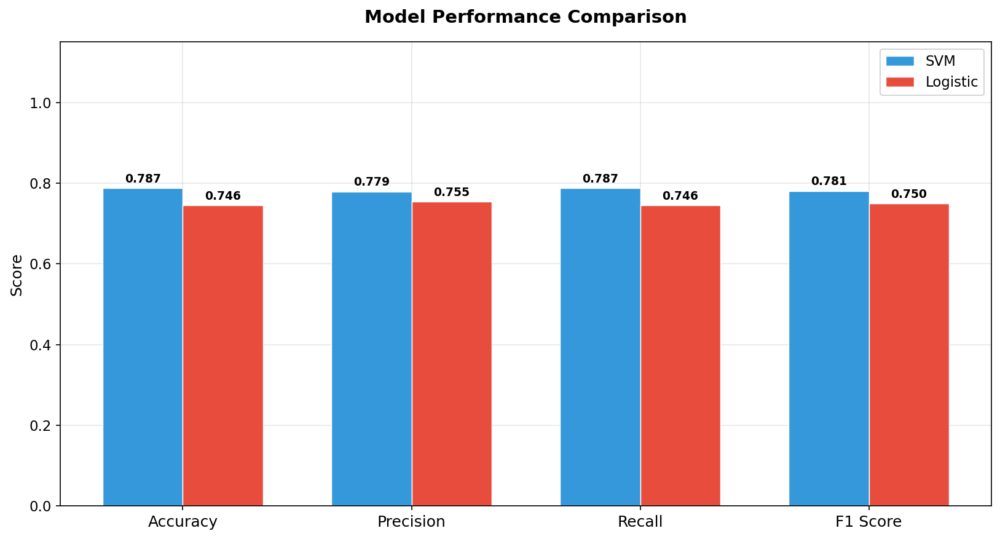
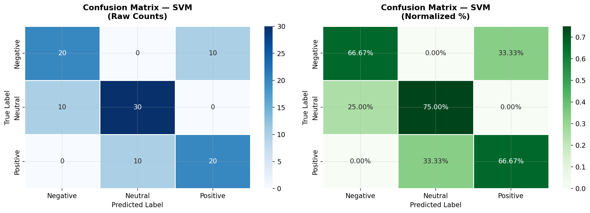

---

### Tab 2 — 🐦 Live Tweet Analysis
> Enter any keyword → fetch tweets → instant sentiment analysis

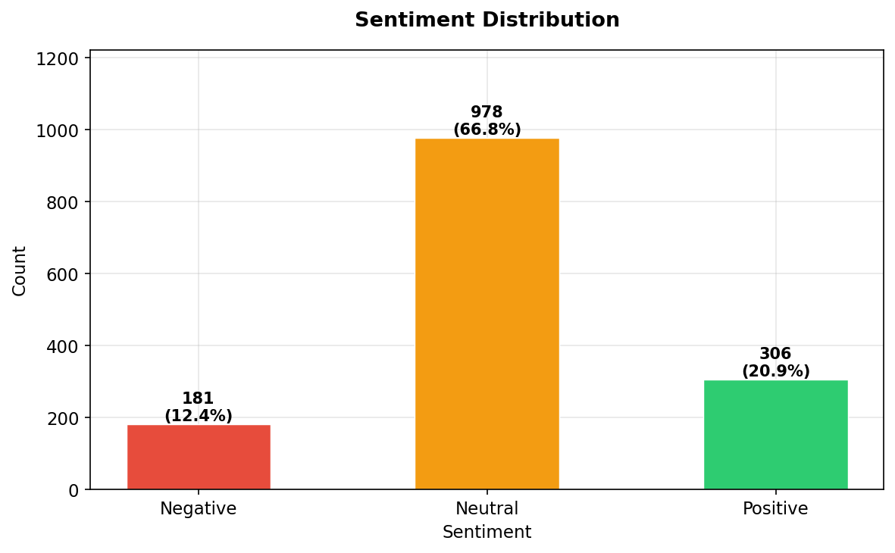

---

### Tab 3 — 📈 Dataset Analysis
> Full 1,433-tweet prediction results with confidence scores

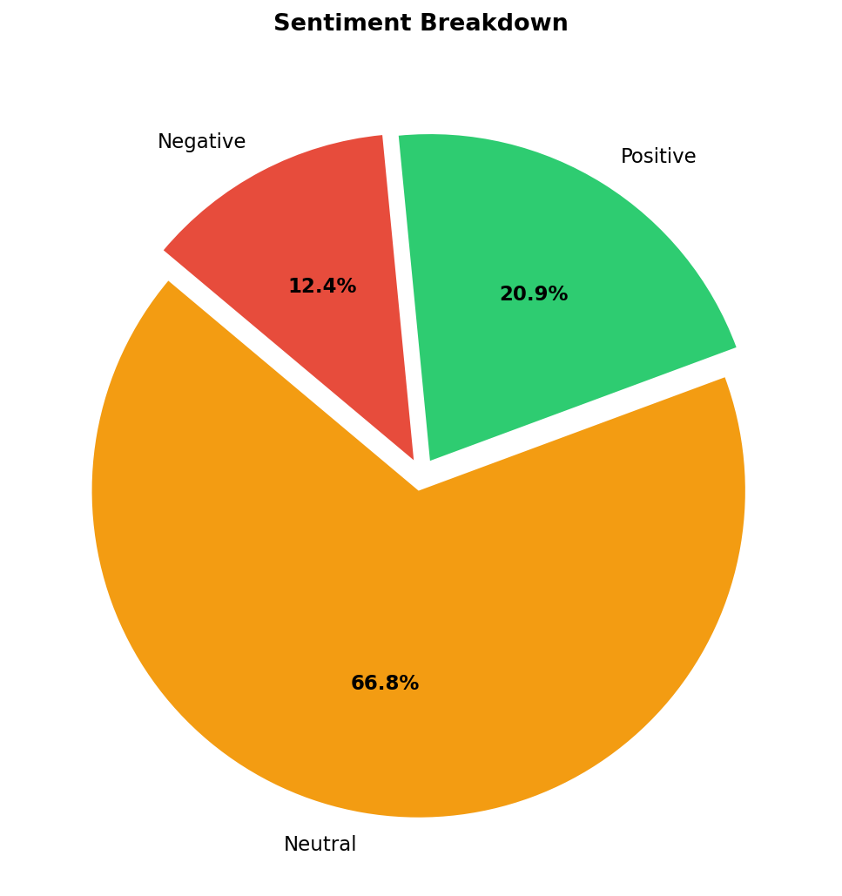
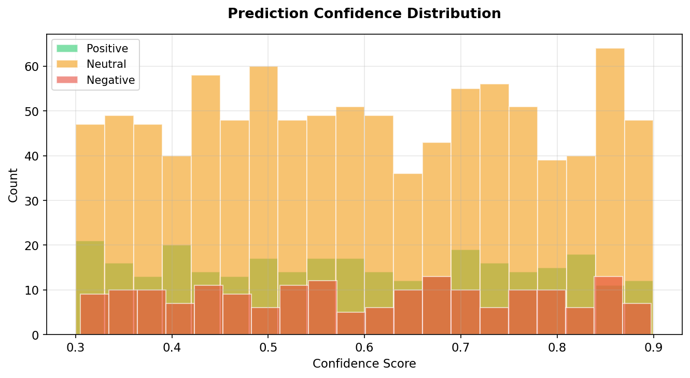

---

### Tab 4 — 🌥️ Word Clouds
> Per-sentiment word frequency — see what words dominate each class

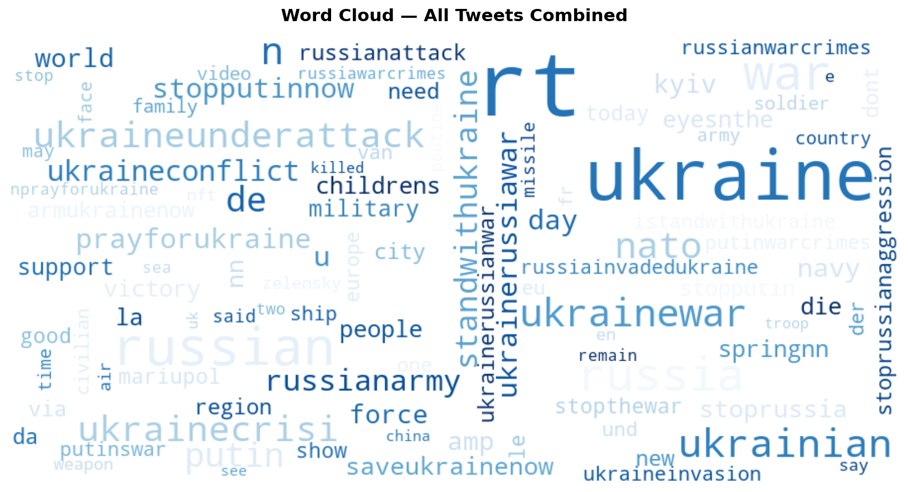
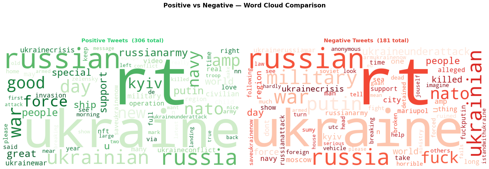
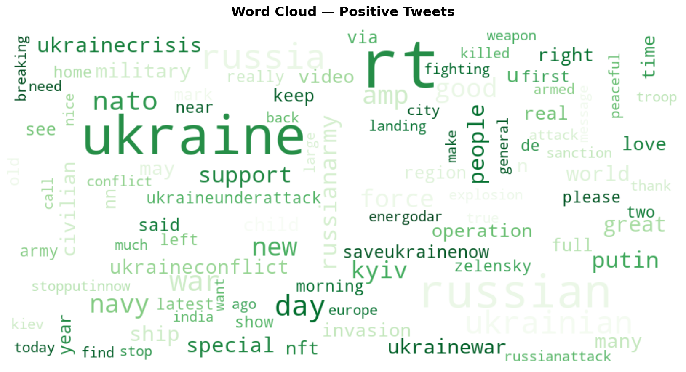
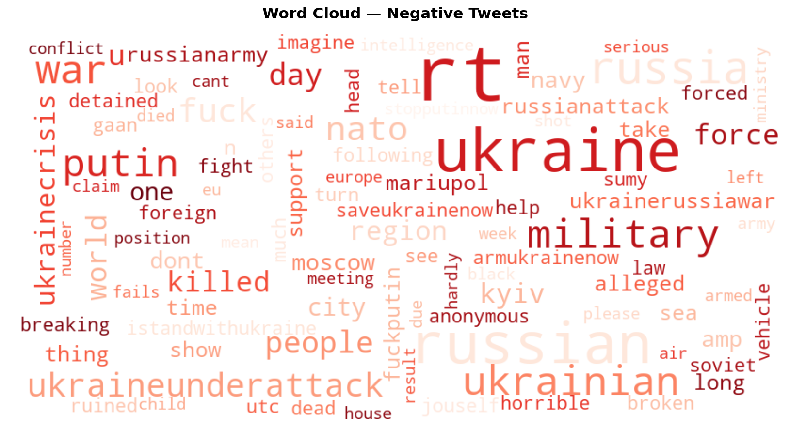
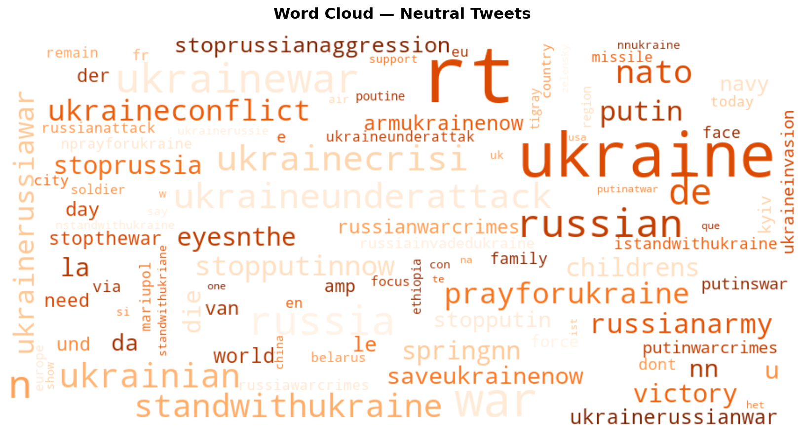

---

### Tab 5 — 🔍 Explainability (SHAP)
> Word-level contribution chart — green pushes toward, red pushes away


---

### Tab 6 — 🏛️ Leader Analysis
> Sentiment breakdown per political entity with score table

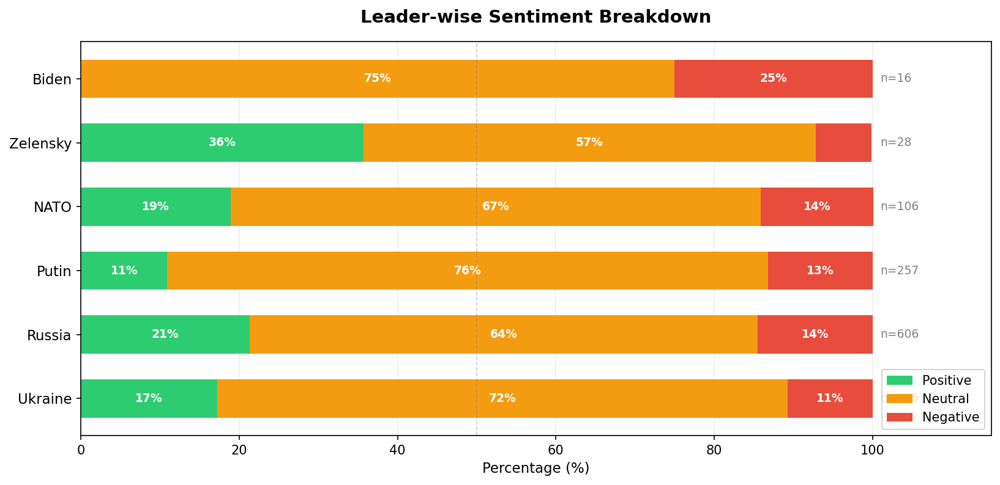
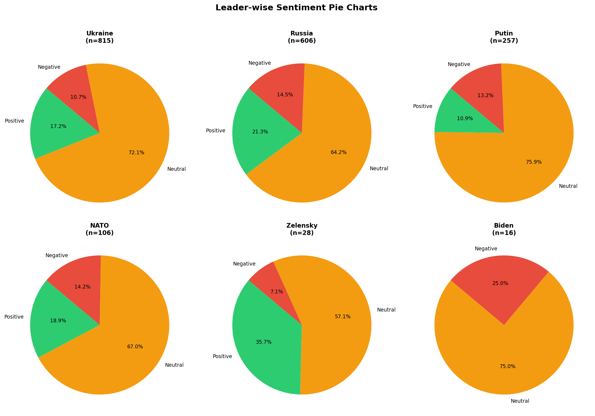
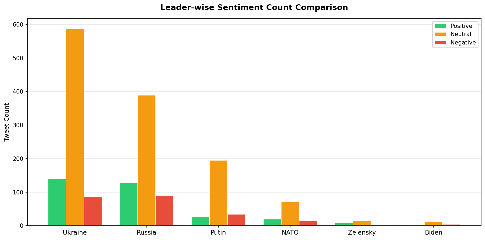
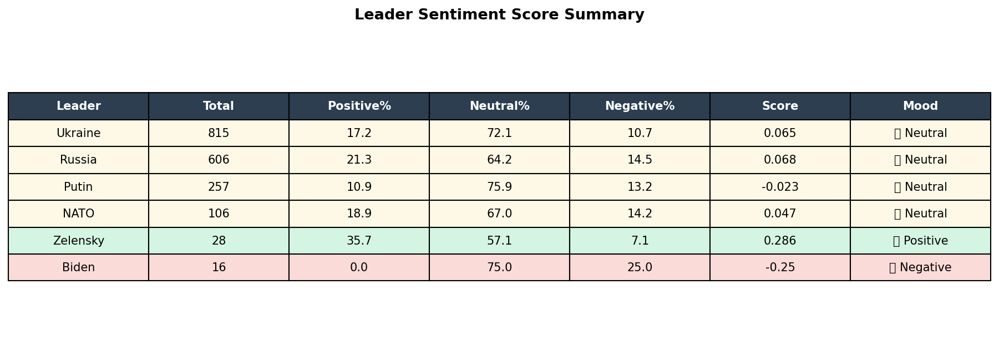

---

## 📦 Dataset

- **Source:** Twitter — Ukraine-Russia War tweets
- **Topics:** NATO, Ukraine, Russia, Putin, Zelensky, Biden and more
- **Format:** CSV files with `text`, `sentiment`, `user` columns
- **Raw rows:** 2,430 (across 26 CSV files)
- **After deduplication:** 1,465 rows
- **After cleaning:** 1,433 rows (final)

---

## ⚙️ Configuration

All settings are centralized in `config/config.py`:

```python
# Model settings
TFIDF_MAX_FEATURES = 5000
TEST_SIZE          = 0.2
RANDOM_STATE       = 42

# Twitter API (optional)
TWITTER_BEARER_TOKEN = "YOUR_BEARER_TOKEN"

# Political entities to track
POLITICAL_LEADERS = ["Putin", "NATO", "Zelensky", "Biden", "Ukraine", "Russia"]
```

### Adding Twitter API Keys (Optional)
1. Go to [developer.twitter.com](https://developer.twitter.com)
2. Create a project and get your keys
3. Update `config/config.py` with real keys
4. Live tweet fetching will activate automatically

---

## 🔮 Future Improvements

- [ ] **Deep Learning** — BERT/RoBERTa for better accuracy
- [ ] **More languages** — multilingual sentiment analysis
- [ ] **Time series** — sentiment trend over time charts
- [ ] **Named Entity Recognition** — auto-detect political entities
- [ ] **Live streaming** — real-time Twitter stream analysis
- [ ] **Export reports** — PDF/Excel export of analysis results
- [ ] **Docker support** — containerized deployment
- [ ] **More datasets** — expand beyond Ukraine-Russia conflict

---

## 🧠 Key Design Principles

| Principle | Implementation |
|-----------|---------------|
| **Separation of concerns** | Each module has single responsibility |
| **No data leakage** | Vectorizer fitted only on training data |
| **No hardcoded paths** | All paths computed from `BASE_DIR` |
| **Lazy loading** | NLTK downloads only when needed |
| **Cached resources** | Models loaded once via `@st.cache_resource` |
| **Graceful fallbacks** | Sample data when Twitter API unavailable |
| **Class balance** | `class_weight='balanced'` in all models |

---

## 📄 License

This project is licensed under the MIT License.

---

## 🙏 Acknowledgements

- Dataset: Ukraine-Russia war tweets collected via Twitter API
- SHAP library by Scott Lundberg
- Streamlit for the amazing dashboard framework
- scikit-learn for ML models

---

<div align="center">

**Built with ❤️ using Python, Streamlit & scikit-learn**

*Political Sentiment Intelligence Dashboard — University ML Project*

</div>
